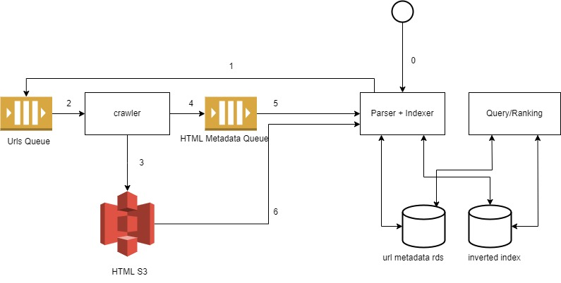

# search-engine
Mini Search Engine which can search the web and display the relevant results for the given search term.
The web pages are crawled and inverted index is created and stored which is used to fetch the results while searching.

---
## Design HLD
The search engine has microservice architecture and contains 3 different microservices namely
- Crawler Service
- Indexer Service 
- Search Service

---
## Microservices & their flow 
1. Crawler Service
   1. Picks up Urls to be crawled from SQS
   2. Downloads the HTML Content and stores it in s3
   3. Sends a message to SQS with crawled page metadata
2. Indexer Service
   1. Sends urls to be crawled to urls SQS
   2. Reads SQS messages from HTML Metadata Queue and starts the orchestration
   3. Downloads the HTML file from s3
   4. Parses the HTML content
   5. Sends relevant child urls for further crawling after updating url metadata and state in RDS
   6. Creates Inverted Index after stemming html content and stores it in DB
3. Search Service
   1. UI Facing service which uses REST APIs
   2. Given a search Query, parses the query and searches for the search terms in the inverted index 
   3. Fetches url metadata of all the relevant urls
   4. Ranks result based on different metrics such as count, page rank, isPresentInTitle etc based on separate algorithm
   5. Displays top results

---
### Prerequisites to run
1. AWS Local setup via cli
2. 2 AWS SQS required for Crawler and Indexer Service
3. S3 bucket setup in both Crawler and Indexer Service
4. Local RDS and MongoDB setup. The config needs to be updated in Indexer and Search Service

#### Steps to run
- Check each of the application.properties file and update different configs like sqs url, mongo and rds url and creds
- Can also change the port in the appliaction.properties file
- In indexservice, Constants.java file, change the MAX_NUMBER_OF_CRAWLED_PAGES to increase the number of crawled pages per run. This was done for testing to control AWS resourcce costs.
- Once the configs are set correctly, start different services on different ports using java/mvn commands

---
#### Future Scope

1. While searching, search for synonyms as well
2. Implement autocomplete system using Trie
3. Improve Ranking algo → together words get higher search rank  
---
#### References

- [Inverted Index](https://www.educative.io/answers/what-is-an-inverted-index)
- [Porter Stemming Algorithm](https://vijinimallawaarachchi.com/2017/05/09/porter-stemming-algorithm/)
- [Ranking Factors at Goggle](https://www.google.com/search/howsearchworks/how-search-works/ranking-results/)
